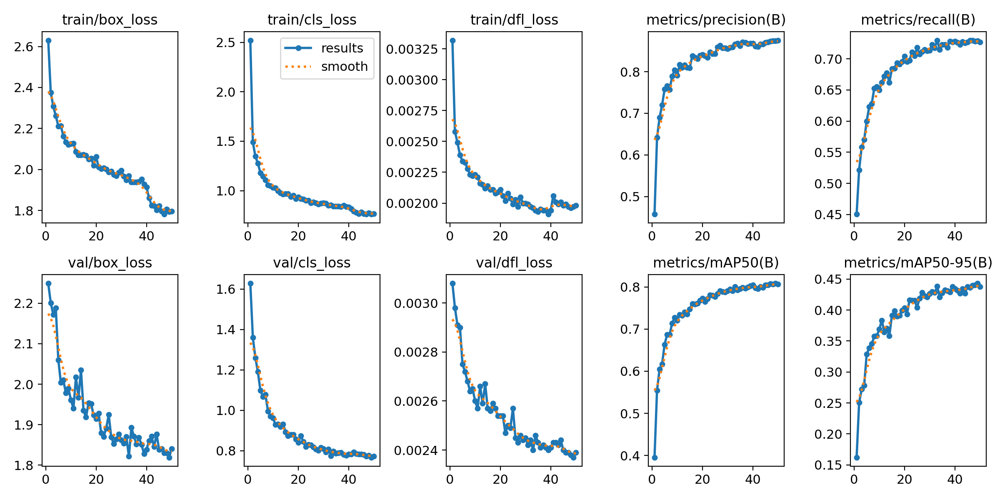
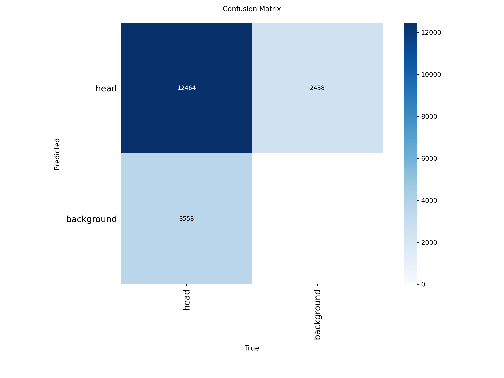
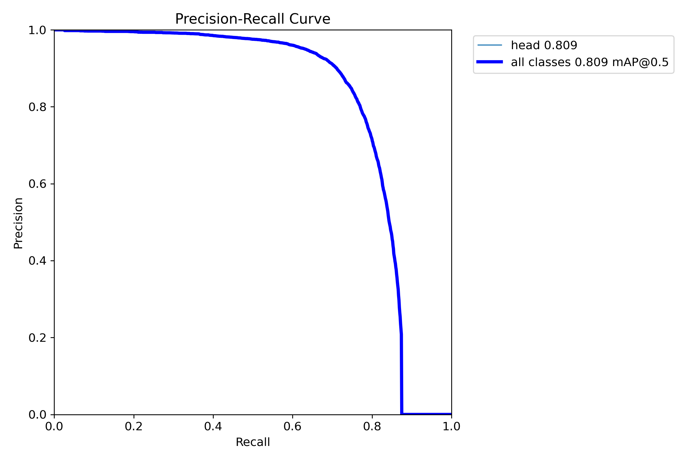
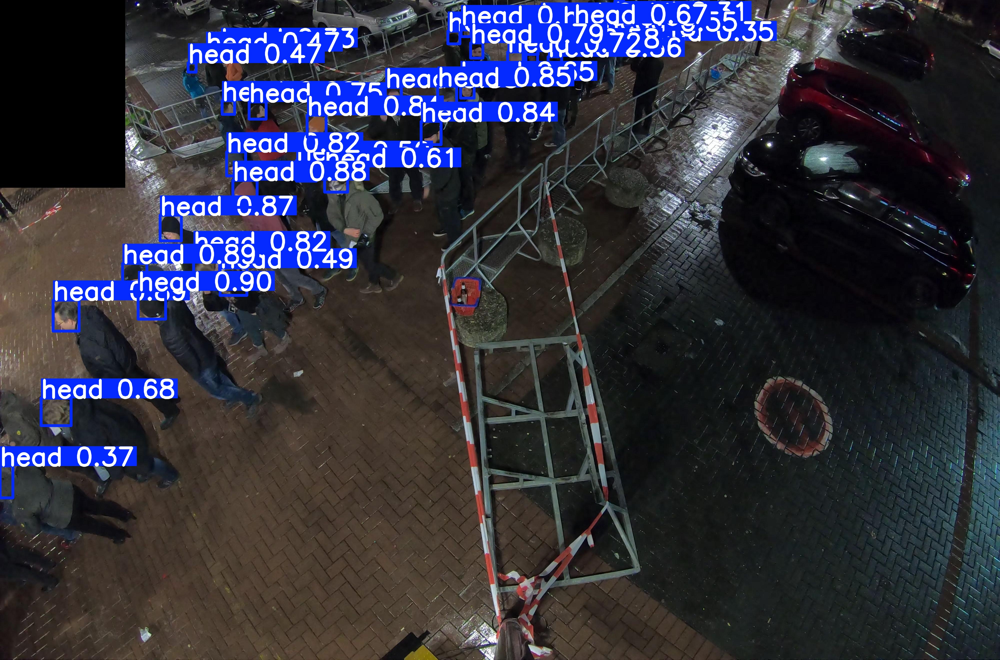

# Fireworks Crowd Density Estimator

A real-time crowd density comparison system for fireworks viewing spots. Detects and counts people across multiple camera feeds using a fine-tuned YOLO26n head detector, then ranks viewing spots from least to most crowded to recommend better alternatives.

## Project Status

## Project Status

✅ YOLO-based head detection model trained and evaluated  
✅ Crowd ranking engine completed  
✅ Streamlit dashboard completed  
✅ Interactive map and viewing spot recommendation added  

Future improvements include real-time camera integration and live routing.

## Problem

Crowd density estimation is a solved research problem, but no existing system combines real-time multi-camera density comparison with actionable spot recommendations for transient, single-night outdoor events like fireworks displays. Consumer apps rely on historical footfall data tied to permanent venues; this project works from live camera feeds alone, with no prior calibration or history required.

## Architecture

Camera Feeds → Frame Grabber (OpenCV) → Preprocessing (low-light correction)
→ YOLO26n Head Detector → Density Normalization (homography)
→ Ranking Engine → Recommendation Logic (distance + ETA)
→ Streamlit Dashboard

## Streamlit Application

The application layer integrates the crowd ranking output with location-based recommendations.

Features:

- Load crowd ranking data from JSON output
- Compare multiple viewing spots
- Calculate distance from user location
- Recommend the best viewing spot
- Interactive map visualization using Folium
- Highlight recommended location

## Model Results

Fine-tuned YOLO26n on the RPEE-Heads dataset (1,346 training images, 109,913 head annotations from railway platforms and event entrances).

| Metric | Score |
|---|---|
| Precision | 0.874 |
| Recall | 0.729 |
| mAP50 | 0.809 |
| mAP50-95 | 0.443 |

Training curves:



Confusion matrix:



Precision-recall curve:



Sample detection on a low-light outdoor scene:



## Dataset

[RPEE-Heads](https://doi.org/10.34735/ped.2024.2) — Railway Platforms and Event Entrances Heads dataset, licensed CC BY-SA 4.0. Not redistributed here due to size and licensing; download instructions are in the training notebook.

## Repository Structure

```text
.
├── notebooks/
│   └── Model training and evaluation notebooks
│
├── models/
│   └── Trained YOLO head detection weights
│
├── src/
│   └── ranking_engine.py
│
├── output/
│   └── ranking_output.json
│
├── app/
│   ├── app.py
│   ├── data_loader.py
│   ├── recommendation.py
│   ├── locations.py
│   ├── map_utils.py
│   └── map_view.py
│
├── results/
│   └── Training curves, evaluation plots, sample predictions
│
├── requirements.txt
└── README.md
```

## Usage

```python
from ultralytics import YOLO

model = YOLO("models/head_detector_yolo26n.pt")
results = model.predict(source="your_image.jpg", conf=0.3)
```
## Run Dashboard

Install dependencies:

pip install -r requirements.txt

Navigate to app folder:

cd app

Run:

streamlit run app.py

The dashboard provides:

Crowd density ranking
Viewing spot recommendation
Distance calculation
Interactive map visualization
Requirements

## Requirements

Install all dependencies:

pip install -r requirements.txt

## License

Code is licensed under MIT. The trained model weights inherit the CC BY-SA 4.0 share-alike condition from the RPEE-Heads dataset used for fine-tuning.

## Credits

- [RPEE-Heads Dataset](https://arxiv.org/abs/2411.18164) — Boltes et al., 2024
- [Ultralytics YOLO26](https://docs.ultralytics.com/models/yolo26)
